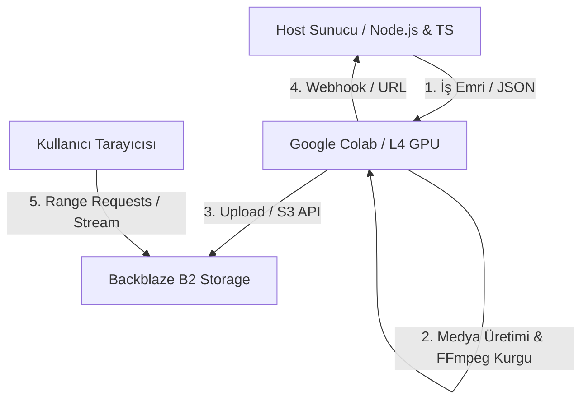

# AI-Publisher Otonom Video Üretim ve Kurgu Sistemi İşleyiş Kılavuzu

Bu doküman, AI-Publisher projesinin Google Colab (Yapay Zeka & Kurgu Katmanı), Node.js (Orkestrasyon & İş Kuyruğu) ve Backblaze B2 (Medya Depolama) arasındaki hibrit çalışma prensiplerini, kurgu akışını ve Docker optimizasyon stratejilerini açıklamaktadır.

---

## 🏛️ 1. Genel Mimari Yapısı

Sistem, CPU/RAM ve GPU maliyetlerini en iyi seviyede tutabilmek amacıyla 3 temel katman üzerine inşa edilmiştir:



1.  **Beyin (Host Sunucu - 7/24 Aktif):** Web arayüzünü, veritabanını (SQLite/PostgreSQL) ve Redis (SSE Durum) katmanlarını yönetir. Gemini API ve Zen modelleri ile master promptları sahnelere ve pazarlama metinlerine böler. Ağır video render ve FFmpeg işlemleriyle uğraşmaz, sadece orkestratör olarak çalışır.
2.  **Kas (İşçi - Google Colab / RunPod L4 GPU):** Yapay zeka modellerini (CogVideoX, XTTS, AudioLDM2) barındırır. İş geldiğinde uyanır, video sentezi, altyazı gömme, logo yerleştirme, renk derecelendirme ve ses miksleme adımlarını GPU gücüyle kendi lokal NVMe diskinde tamamlayıp webhook ile Node.js'e bildirir.
3.  **Depo (Backblaze B2 - S3 Uyumlu):** Terabayt başına aylık ~$6.95 maliyetiyle videoları saklar. Kullanıcıların tarayıcıları videoları doğrudan buradan stream eder.

---

## 🎬 2. EDL (Edit Decision List) ve Tarayıcı Tabanlı Kurgu

Kullanıcılar videoları bilgisayarlarına indirmeden tarayıcıda düzenleyebilirler.

### A. HTTP Range Requests (Kısmi Veri Akışı)
Tarayıcıdaki `<video>` oynatıcısı, Backblaze B2’de duran 100 MB'lık bir videonun tamamını indirmek yerine, kullanıcının playhead (imleç) ile tıkladığı saniyeye ait parçayı indirir. 
*   Örnek istek başlığı: `Range: bytes=5000000-7000000` (Sadece 3. saniyeye denk gelen 2 MB veri çekilir).
*   Bu işlem için Backblaze B2 üzerinde **CORS (Cross-Origin Resource Sharing)** kuralları aktiftir.

### B. Kurgu Karar Listesi (JSON Blueprint)
Kullanıcı editörde kırpma, ses ekleme veya altyazı düzenleme yaptığında gerçek video dosyaları değişmez. Tarayıcı sadece bir kurgu karar listesi (EDL JSON) hazırlar:

```json
{
  "project_id": "job_123",
  "audio_track": "https://f004.backblazeb2.com/audio/bg_music.mp3",
  "audio_volume": 0.4,
  "timeline": [
    {
      "scene_id": "scene_1",
      "video_url": "https://f004.backblazeb2.com/raw/scene_1.mp4",
      "start_time": 0.0,
      "end_time": 4.5,
      "subtitle": "Yapay zeka dünyası hızla değişiyor..."
    }
  ]
}
```

Bu JSON buluttaki Süper-İşçi'ye gönderilir. Süper-İşçi içindeki FFmpeg, bu talimatlara göre kırpma, birleştirme ve miksleme işlemlerini saniyeler içinde tamamlayıp B2'ye yükler.

---

## 📦 3. "Süper-İşçi" (All-in-One Worker) Docker Optimizasyonu

Ağır kütüphanelerin (PyTorch, CUDA, Whisper, FFmpeg) ve model ağırlıklarının (CogVideo, SVD, XTTS) tek bir Docker imajına gömülmesi imaj boyutunu 15-20 GB seviyesine çıkarır. Bu durum "Cold Start" (ilk açılış) süresini uzatır. Bunu aşmak için:

*   **Kod ve Ağırlıklar Ayrılmıştır:** Docker imajı sadece CUDA runtime, FFmpeg, Python ve PIP paketlerini içerir (Boyut: ~6-8 GB). Base image olarak `nvidia/cuda:12.1.1-cudnn8-runtime-ubuntu22.04` kullanılır.
*   **Network Volume Mount:** Model ağırlıkları RunPod veya Google Drive üzerindeki kalıcı bir alanda tutulur. Konteyner ayağa kalkarken `/workspace/models` patikasına mount edilir. Python kodu modelleri internetten çekmek yerine bu hızlı disk yolundan saniyeler içinde VRAM'e yükler.

---

## ⚙️ 4. v7.0 Colab-Heavy Kurgu ve Kaniko Derleme Mekanizması

v7.0 ile birlikte sistemin kararlılığını ve performansını artırmak amacıyla iki büyük güncelleme yapılmıştır:

### A. Colab-Heavy Kurgu ve Node.js Bypass
*   **Yerel Sunucu Yükünün Sıfırlanması:** Altyazı gömme (Burn-in subtitles), farklılaştırma filtreleri, logo/watermark yerleşimi ve ses miksleme gibi ağır FFmpeg kodlama (encoding) adımları tamamen Google Colab tarafına taşınmıştır.
*   **Bypass Logic (`queue.ts`):** `MOCK_COLAB === 'false'` iken Node.js kuyruk servisi yerel FFmpeg miksleme fonksiyonlarını bypass eder. Colab tarafı pre-mixed sahne videosunu ürettiğinde bunu Node.js sunucusundaki callback webhook adresine POST eder.
*   **Hızlı Concat:** Sahnelerin tamamı üretildiğinde Node.js backend'i sadece `-c copy` (demuxer) kullanarak sahneleri birleştirir. Bu işlem CPU tüketmeden 1 saniyeden kısa sürede tek parça video üretir.

### B. Kaniko ve Local Registry ile Docker Derleme
*   **Cgroup read-only bypass:** Google Colab ortamlarındaki kernel ve cgroup kısıtlamalarını aşmak amacıyla daemonless **Kaniko** mimarisine geçilmiştir.
*   **Local Registry (`localhost:5000`):** Imajlar arası bağımlılık zincirini koparmamak için Colab VM'de hafif bir Registry çalıştırılır. `build_all.sh` betiği Kaniko ile derlediği taban imajı yerel registry'ye push eder ve diğer model imajları bu registry'den `FROM localhost:5000/ai-publisher-base:latest` olarak türetilir.
*   **Otomatik Google Drive Yedekleme:** Derlenen 11 adet Docker imajı, paralel `pigz` aracıyla sıkıştırılarak `.tar.gz` formatında Google Drive'a yedeklenir.

---

## 🚀 5. Geliştirme (Dev) ve Üretim (Prod) Yol Haritası

*   **Geliştirme Aşaması (Dev):** Colab CPU High-RAM modunda Kaniko ve local registry ile Docker imajları derlenir. Oluşan `.tar.gz` imajları Google Drive'a yedeklenir. Geliştiriciler yerel makinede `npm run dev` çalıştırır, Colab GPU vm ise tünel (Ngrok) aracılığıyla istekleri işler.
*   **Üretim Aşaması (Prod):** Docker imajları GCP Artifact Registry veya RunPod Serverless platformuna yüklenir. Spot VM'ler ve Lazy Loading API'leri ile maliyetler %70 oranında azaltılır. Depolama alanı için 7 günlük otomatik silme (TTL) politikası uygulanarak B2 alanı optimize tutulur.
