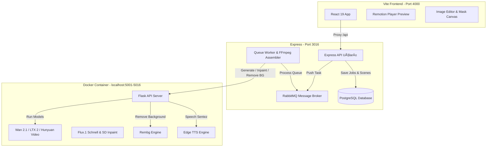

# 2026-06-12 React + Vite Portal, Remotion Timeline Editörü ve GeliÅŸmiÅŸ Görsel Stüdyo Mimarisi (Spec)

Bu tasarım dokümanı, platformun kullanıcı arayüzünü **React + Vite + Tailwind CSS** modern mimarisine taşımak, `@remotion/player` tabanlı profesyonel bir timeline editör yerleşimi kurmak ve Docker GPU container katmanını **FP8 düzeyinde yeni nesil video/imaj modelleri (Wan 2.1, LTX 2, Hunyuan, Flux)** ve **Edge-TTS** ile hızlandırmak için gerekli olan mimariyi ve Odysseus esintili gelişmiş fotoğraf editörü (Background Removal, Inpainting Mask) yeteneklerini tanımlar.

---

## 1. Proje Amacı ve Kapsam

Mevcut Express SSR (sunucu taraflı şablon) mimarisi, zengin etkileşim gerektiren timeline manipülasyonları ve gelişmiş imaj düzenleme özellikleri için hantal kalmaktadır. Bu dönüşümle birlikte:
*   Arayüz, CapCut/Premiere kalitesinde, katmanlı (video ve ses kanalları ayrışmış) ve **Neon Cyan** koyu tema uyumlu bir React uygulamasına dönüştürülecektir.
*   **Port Kısıtı:** Frontend geliştirme sunucusu (Vite) kesinlikle **4000** portunda çalışacaktır. Backend Express API ise mevcut **3016** portunda kalacak ve Vite dev tünelinden proxy edilecektir. Yeni port ihtiyacında kullanıcıya mutlaka sorulacaktır.
*   **Remotion Timeline:** Kullanıcılar sahnelerin yerini sürükle-bırak ile değiştirebilecek, araya yeni sahne ekleyip silebilecek ve sadece seçilen sahneyi tekrar üretebilecektir (Regenerate).
*   **Docker Yeni Nesil FP8 & Edge-TTS:** Kurulumu 10+ dakika süren coqui-tts tamamen kaldırılacak; seslendirmede Edge-TTS ve OpenAI TTS kullanılacaktır. Video üretiminde VRAM dostu, FP8 hassasiyetinde **Wan 2.1**, **LTX 2** veya **Hunyuan Video** Hugging Face Diffusers lazy-load mimarisi entegre edilecektir. Karakter tutarlılığı için ilk kare **Flux (FP8)** ile üretilip canlandırılacaktır (Image Anchored Synthesis).
*   **Fotoğraf Editörü & Arka Plan Temizleme:** Odysseus projesindekine benzer şekilde, yüklenen materyaller için tarayıcıda Canvas tabanlı fırça ile maske çizilip Docker container'a inpainting isteği yollanabilecek ve tek tıkla `rembg` (Docker container'da çalışan) aracılığıyla arka plan temizlenebilecektir.

---

## 2. Teknik Mimari ve Model Seçimleri

### 2.1. Docker GPU Container Katmanı (`docker_image/`)
*   **Ağır kütüphanelerin tasfiyesi:** `coqui-tts` ve tüm bağımlılıkları (`espeak-ng`, `TTS` vb.) kaldırılacak. Yerine sadece hafif `edge-tts` kurulacaktır.
*   **FP8 Video Modelleri (Lazy Load):**
    *   **Wan 2.1 (FP8):** `Wan2_1-I2V-14B-480P-quantized` veya `Wan2_1-T2V-1.3B-quantized`.
    *   **LTX 2 (FP8):** `LTX-Video-quantized`.
    *   **Hunyuan Video (FP8):** `HunyuanVideo` (8-bit quantized).
    *   *Modeller, ilk istek geldiğinde VRAM'e yüklenecek (lazy load) ve iş bittiğinde `torch.cuda.empty_cache()` ile temizlenecektir.*
*   **Flux (FP8) & Stable Diffusion Inpaint:**
    *   **Flux.1-schnell (FP8):** Karakter sabitliği için ilk referans görselin (Anchor Frame) üretilmesinde kullanılacaktır.
    *   **Stable Diffusion XL Inpaint (FP8) veya Flux Inpaint:** Canvas maskesi ile gelen görsellerin inpaint edilmesi için kullanılacaktır.
*   **Arka Plan Temizleme (Rembg):**
    *   Docker container'a `rembg[gpu]` paketi kurulacaktır.
    *   `/remove-background` rotası, gönderilen resmi `rembg.remove` fonksiyonu ile işleyip arka planı temizlenmiş şeffaf PNG olarak geri döndürecektir.
*   **Dudak Senkronizasyonu (Lip-Sync):**
    *   OpenCV tabanlı esnek genlik esnetme algoritması korunacak, ancak ağır XTTS yerine Edge-TTS ses dosyaları ile beslenecektir.

### 2.2. Node.js & TypeScript API Katmanı (`src/`)
*   Mevcut RabbitMQ kuyruk yönetimi, PostgreSQL entegrasyonu, i18n sistemi ve Fırsatlar Hunisi mantığı aynen korunacaktır.
*   Express sunucusu `/api/v1/` ön ekiyle API uçları sunacaktır:
    *   `POST /api/v1/jobs/create`: Yeni proje oluÅŸturma (Zod validator devrede).
    *   `GET /api/v1/jobs/:id`: İş detayları (sahneler ve pazarlama metinleri).
    *   `POST /api/v1/jobs/:id/update-scenes`: Sahnelerin sırasını/içeriğini güncelleme (Remotion Timeline'daki değişikliklerin DB'ye kaydedilmesi).
     *   `POST /api/v1/jobs/:id/regenerate-scene`: Sadece belirli bir sahneyi Docker container'a tekrar ürettirme.
     *   `POST /api/v1/editor/remove-background`: Görseli alıp Docker container'a iletir, temizlenen şeffaf görseli kaydeder.
     *   `POST /api/v1/editor/inpaint`: Görsel + Maske verisini alıp Docker container'a iletir, düzenlenen görseli kaydeder.

### 2.3. React + Vite Frontend Katmanı (`client/` - Port 4000)
*   **Teknoloji Yığını:** React 19, Vite, Tailwind CSS, Lucide React (ikonlar), `@remotion/player` (video timeline önizleme).
*   **Timeline Editörü Tasarımı:**
    *   **Görsel Raylar (Tracks):** Üstte video sahneleri, altta onlara bağlı ses kanalları (Edge-TTS + SFX) yatay timeline şeritleri halinde listelenecektir.
    *   **Sürükle-Bırak (Drag-and-Drop):** Sahneler sürüklenerek yer değiştirebilecektir (`@hello-pangea/dnd` veya hafif HTML5 Drag/Drop API ile).
    *   **Önizleme (Remotion Player):** Seçilen sahnelerin render edilmemiş halleri (varsa resim + ses, yoksa placeholder) anlık olarak Remotion Player üzerinde oynatılabilecektir.
    *   **Tekil Yenileme (Regenerate):** Her sahne kartının üzerinde "Yeniden Üret" butonu yer alacak, bu sayede tüm projeyi bozmadan sadece o sahne Colab'a gönderilip güncellenecektir.
*   **Fotoğraf Editörü Paneli:**
    *   Görsel yükleme veya Flux ile görsel üretme sonrasında açılan modal içinde **Canvas Editörü** yer alacaktır.
    *   **Fırça Boyutu ve Rengi (Maskeleme):** Kullanıcı fare ile görselin düzenlemek istediği yerini (inpainting alanı) maskeleyebilecektir (siyah/beyaz maske üretimi).
    *   **Arka Planı Kaldır Butonu:** `rembg` endpoint'ine istek atarak resmi şeffaflaştıracaktır.
    *   **Flux Inpaint Butonu:** Çizilen maske ve yeni bir metinsel prompt ile sadece maskeli alanı değiştirecektir.

### 2.4. Kamera Hareket Şablonları (Motion Templates)
*   **Arayüz Kontrolleri:** Timeline'daki her bir sahne kartı üzerinde bir "Kamera Hareketi" (Camera Motion) seçim kutusu bulunacaktır.
*   **Şablon Seçenekleri:** Yok (None), Zoom In (Yakınlaşma), Zoom Out (Uzaklaşma), Pan Left (Sola Kaydırma), Pan Right (Sağa Kaydırma) ve Breathing (Nefes/Doğal Titreşim).
*   **Prompt Entegrasyonu:** Seçilen hareket şablonuna karşılık gelen prompt tanımları (Örn: `", camera zooming in slowly, cinematic movement"`, `", camera panning left, horizontal motion"`) Node.js tarafında kuyruk işlenirken orijinal promptun sonuna otomatik eklenecektir. Bu sayede Wan 2.1 ve LTX 2 gibi modern I2V/T2V modellerinin doğal kamera kontrol yetenekleri sıfır ekstra donanım maliyetiyle canlandırılacaktır.

---

## 3. Arayüz ve Görsel Tasarım (Neon Cyan Dark Mode)

Kullanıcı arayüzü, CapCut ve Premiere Pro gibi modern video kurgu yazılımlarından ilseler alacaktır:
*   **Renk Paleti:** Derin grafit arka planlar (`#0B0F19`), neon cyan vurgular (`#00F2FE`), elektrik moru detaylar (`#9B51E0`) ve temiz beyaz tipografi.
*   **Timeline Düzeni:** Sayfanın alt kısmını kaplayan, yatay olarak kaydırılabilen (horizontal scroll), zaman çizgisi ve oynatma kafası (playhead) simülasyonu barındıran katmanlı yapı.
*   **Fırsatlar Hunisi:** Yenilenen React arayüzünde, sol veya üst panelde modern bir kart akışı şeklinde entegre edilecek, "Prompt Olarak Kullan" tıklandığında anında timeline üzerinde yeni sahneler oluşturacaktır.



---

## 4. Veritabanı Şeması Güncellemeleri

`users` ve `video_jobs` tablolarına ek olarak, sahnelerin esnek sıralanması ve yönetimi için `video_scenes` tablosu eklenecektir:

```sql
CREATE TABLE IF NOT EXISTS video_scenes (
  id SERIAL PRIMARY KEY,
  job_id INTEGER REFERENCES video_jobs(id) ON DELETE CASCADE,
  scene_number INTEGER NOT NULL,
  video_prompt TEXT NOT NULL,
  speech_text TEXT,
  sfx_prompt TEXT,
  camera_motion VARCHAR(50) DEFAULT 'none', -- none, zoom_in, zoom_out, pan_left, pan_right, breathing
  image_path TEXT,          -- Flux ile üretilen veya yüklenen referans görsel
  mask_path TEXT,           -- Inpainting için çizilen maske
  video_path TEXT,          -- Colab'ın ürettiği sahne videosu
  audio_path TEXT,          -- Üretilen ses dosyası
  status VARCHAR(20) DEFAULT 'pending', -- pending, generating, completed, failed
  sort_order INTEGER NOT NULL
);
```

`video_jobs` tablosuna da `model_type` (wan, ltx, hunyuan) alanı eklenecektir.

---

## 5. Doğrulama ve Test Planı

### 5.1. Otomatik Testler
*   `client/` dizininde Vitest ve React Testing Library ile:
    *   Timeline sürükle-bırak sıralama mantığının testi.
    *   Fotoğraf editörü canvas çizim ve maske üretimi testi.
*   Backend entegrasyon testlerinin (`src/test_differentiation.spec.ts` ve `src/test_integration.spec.ts`) React API rotalarıyla uyumlu olacak şekilde güncellenmesi.

### 5.2. Manuel DoÄŸrulama
1.  **Vite Server Doğrulaması:** `npm run dev` (Frontend) çalıştırılıp tarayıcıda `http://localhost:4000` adresi açılacak. Tema geçişleri ve i18n kontrol edilecek.
2.  **Timeline Sürükle-Bırak:** 3 sahne oluşturulup sıraları değiştirilecek, veritabanına doğru `sort_order` ile kaydedildiği izlenecek.
3.  **Tek Sahne Yenileme:** Sadece 2. sahne için "Yeniden Üret" tetiklenecek, Colab'a sadece o sahnenin verilerinin gittiği doğrulanacak.
4.  **Arka Plan Temizleme:** Panele bir görsel yüklenecek, "Arka Planı Kaldır" tıklandığında Colab'dan transparan görselin döndüğü ve timeline'a yerleştiği gözlemlenecek.
